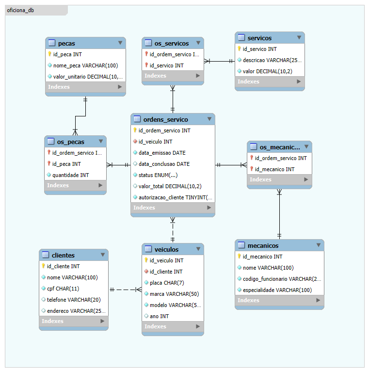

# Database Schema for Auto Repair Shop 🛠️

**Oficina DB** is a complete relational database schema designed to manage the operations of an auto repair shop. It coordinates every step of the service process, from customer and vehicle registration to work order management, parts inventory, and final billing. This project ensures data integrity, operational efficiency, and a solid foundation for business analytics.

 

  

 

The system is built around four core entities:

* **Clients & Vehicles**: Manages customer information and their associated vehicle history, creating a complete record for each client.

* **Work Orders**: The central entity of the system. It tracks each service request, linking vehicles, mechanics, required parts, and performed services.

* **Services & Parts**: A catalog of all available services and inventory parts, including their standard costs, which are used to calculate the final invoice for a work order.

* **Mechanics**: A registry of the technical staff, including their specializations, allowing for efficient allocation of tasks based on skill sets.

## **Key Features**

* **Complete Service Workflow**: Models the entire repair process, from initial customer authorization to the final status of the work order.

* **Vehicle Service History**: By linking work orders to specific vehicles, the system automatically builds a detailed service history, which is valuable for both mechanics and customers.

* **Team and Resource Allocation**: Allows multiple mechanics to be assigned to a single work order and tracks every part used, ensuring accurate billing and inventory control.

* **Detailed Cost Calculation**: The structure is designed to accurately calculate the total cost of any work order by summing the values of services performed and parts used.

* **Analytics-Ready**: The schema is optimized for generating key performance indicators (KPIs), such as mechanic productivity, service popularity, and revenue per client.

## **Database Architecture**

The schema follows a structured relational model to ensure a robust and maintainable data layer for any management software.

* **Model Layer**: Contains the core business entities (Clients, Vehicles, Work Orders) and their relationships, enforced by primary and foreign keys to ensure referential integrity.

* **Integrity Layer**: Implements business rules directly at the database level, such as the uniqueness of a vehicle's license plate (`placa`) and a client's document (`cpf`).

* **Query Layer**: The relational design is ideal for complex queries that provide a 360-degree view of operations, such as retrieving the full details of a work order, including the client, vehicle, assigned mechanics, and all associated costs.

 

**Oficina DB** is designed for scalability, capable of supporting a small local shop or a large service center with multiple technicians. The project emphasizes a clean data model and a maintainable architecture to ensure long-term reliability and straightforward future enhancements.
